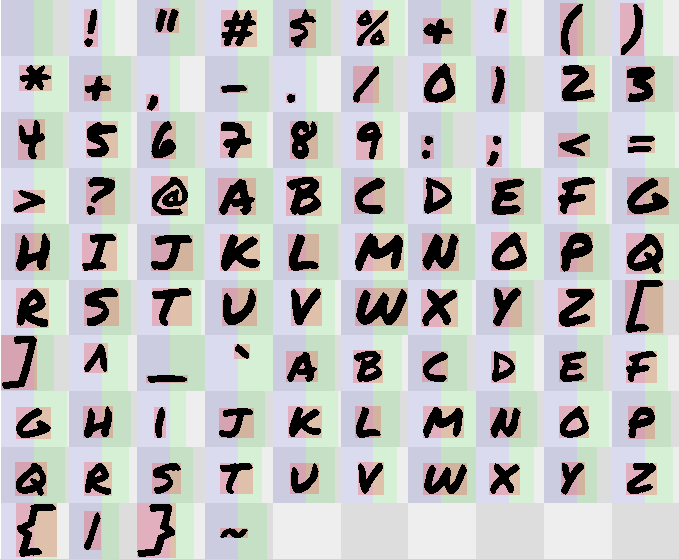

pdfontconv
==========

This is a browser-based tool to convert TTF, OTF, WOFF and WOFF2 fonts into `.fnt` files for use with the [Playdate](https://play.date) SDK.

Requirements
------------

A modern browser. Tested in Firefox 125 and Chromium 124.

The UI was not designed for use on mobile or other small screens. In fact, you might argue it wasn't designed at all.

Features
--------

- Left-to-right text.
- No clipping or incomplete rendering of characters, ever.
- Kerning.

Missing features
----------------

- Customizations like italics and weight. These are easy to add; let me know if you have a need for it.
- Large character sets may cause your browser to hang when you make any changes. This happens because browser APIs don't offer a way to read the kerning table, so the tool brute-forces the kerning table by measuring every pair of characters separately. If this becomes a problem, I can add some code to parse the kerning table from the font file directly. Again, let me know if you need this.

Inherent limitations
--------------------

The Playdate's [font format](https://github.com/cranksters/playdate-reverse-engineering/blob/main/formats/fnt.md) is very simple, so a lot of features will never be supported, such as:

- Right-to-left and other text directions.
- Ligatures and other contextual replacements.
- Combining Unicode characters, like accents. But note that you can use a single codepoint where one exists; for example, to obtain `á`, use U+00E1 _Latin Small Letter A with Acute_ instead of `a` (U+0061 _Latin Small Letter A_) combined with `◌́` (U+0301 _Combining Acute Accent_).

Development
-----------

It's just vanilla HTML, JavaScript and CSS, no build tools required. You can just open `index.html` in your browser and start hacking.
